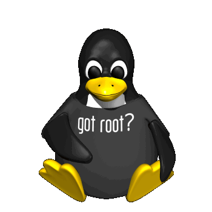

# [**devOps-patch**](https://t.me/devOpsPatch)

A Patch for Dev-Ops community powered by The Community.

## Patch's

- **Prep**
   - Architecting Microsoft Azure Solutions Exam 70-534 Prep  
   - AWS Certified Advanced Networking - Specialty Certification  
   - AWS Certified Developer-Associate 2018 ACloudGuru 
   - AWS Certified Solutions Architect 
   - AWS Certified SysOps Administrator-Associate 
   - CBT Nuggets - Identity with Windows Server 2016 [Exam 70-742] 
   - CBT Nuggets - Installation Storage and Compute with Windows Server 2016 [Exam 70-740] 
   - CBT Nuggets - Networking with Windows Server 2016 [Exam 70-741] 
   - Linux Academy - Red Hat Certificate of Expertise in Ansible Automation Prep Course 
   - Linux Academy - Microsoft Azure 2018 [Exam 70-533] 
   - LinuxAcademy - Linux Foundation Certified Systems Administrator 

- **AWS**
  - AWS for DevOps High Availability and Elasticity 
  - AWS MasterClass DevOps with AWS Command Line Interface CLI StoneRivereLearning 
  - Pluralsight - AWS Certified Solutions Architect-Associate 
  - AWS DevOps Sec Govern Validation 
  - AWS Data Security 
  - Auditing AWS Environments for Security and Best Practices by Chad Smith 
  - AWS for DevOps Continuous Delivery and Process Automation 

- **Azure**
  - Azure Container Instances-Getting Started 
  - Pluralsight - Preparing to Pass the Microsoft Azure 70-533 Exam 
  - Pluralsight - Identity, Application, and Network Services on Microsoft Azure 
  - Pluralsight - Monitoring Microsoft Azure Hybrid Cloud Networks by Tim Warner 
  - Pluralsight - Deploy Azure Virtual Networks, VPNs, and Gateways 

- **Linux / Tool / Mic**
  - DevOps Foundations Lean and Agile 
  - DevOps The Big Picture 
  - Udemy - Learn Devops Continuously Deliver Better Software 
  - EDUmobile Academy - Complete Linux Shell Training for Beginners 
  - Linux Academy - Learning Vagrant 
  - Linux Academy - Mastering The Linux Command Line 
  - Elasticsearch-5 and Elastic Stack - In Depth and Hands On 
  - Mastering ElasticSearch 6.x and the Elastic Stack 
  - JBoss EAP Configuration Deployment and Administration 
  - JBoss in Action Configuring the JBoss Application Server 2012.pdf 
  - Jira-7 Guide for Administrators and Developers 
  - Packpub - DevOps with GIT-Flow Jenkins Artifactory Sonar ELK JIRA 
  - Udemy - Complete DEVOPS with Docke Jenkins GIT Vagrant and Maven 

- **Automates & Configuration Management**
  - Getting Started with Core Features in Ansible 
  - Ansible From Beginner to Pro.pdf 
  - Learn devops infrastructure automation with terraform 
  - Pluralsight - Automating AWS and vSphere with Terraform 
  - Pluralsight - Deep Dive - Terraform 
  - Barbour C., Rhett J. - Puppet Best Practices - 2018.pdf 
  - Uphill T. et al. - DevOps Puppet, Docker, and Kubernetes - 2017.pdf 
  - Linux Academy-Puppet 204 System Administration Using Puppet 
  
- **Docker**
  - Pluralsight - Docker Deep Dive by Nigel Poulton  
  - Docker Mastery 
  - Monitoring Containerized Application Health with Docker 
  - udemy - Docker and Kubernetes, The Complete Guide 2018-09 
  - Integrating Docker With Devops Automated Workflows 
  - O'Reilly - Introduction to CoreOS 

- **Kubernetes**
  - Kubernetes - Up and Running - Dive Into the Future of Infrastructure.pdf 
  - Pluralsight - Getting Started with Kubernetes 
  - Lynda - Kubernetes - Native Tools 
  - Introduction to Kubernetes using Docker 
  - Udemy - learn devops the complete kubernetes course 
  
- **Git**
  - Learn Git in 3 Hours  
  - Git - basic concept fundamentals github 
  - Narebski-J.-Mastering Git-2016 
  - Packt - Git and Version Control 

- **CI/CD**
  - Jenkins Essential Training 
  - Running Jenkins on AWS 
  - Continuous Delivery Using Docker And Ansible 
  - Continuous Integration and Continuous Delivery with AWS Developer Tools 

- **Maven** 
  - O'Reilly - Learning Apache Maven 
  - Udemy - Maven in 20 Steps - Learn Java Dependency Management 
  - Lynda - Java Build Automation with Maven 

- **Microservices**
  - O'Reilly - Developing Ops-Friendly Microservices 
  - Lynda - Kubernetes Microservices 
  - O'Reilly - Building Microservice Systems with Docker and Kubernetes 

- **Bot's**
  - [Hubot](https://hubot.github.com) - Hubot is your friendly robot sidekick. Install him in your company to dramatically improve employee efficiency
  - [lita](https://github.com/litaio/lita) - ChatOps for Ruby, Automate your business and have fun with your very own robot companion.
  - [botpress](https://github.com/botpress/botpress) - The ultimate open-source bot platform with built-in NLU 

- **Tools & Tips**
  - [DevopsWiki](https://github.com/Leo-G/DevopsWiki) - A wiki of Devops Tools, Tutorials and Scripts
  - [the-book-of-secret-knowledge](https://github.com/trimstray/the-book-of-secret-knowledge) - A collection of awesome lists, manuals, blogs, hacks, one-liners, cli/web tools and more. Especially for System and Network Administrators, DevOps, Pentesters or Security Researchers.
  - [test-your-sysadmin-skills](https://github.com/trimstray/test-your-sysadmin-skills) - A collection of *nix Sysadmin Test Questions and Answers. Test your knowledge and skills in different fields with these Q/A.
  - [docker_practice](https://github.com/yeasy/docker_practice) - Learn and understand Docker technologies, with real DevOps practice! 
  - [awesome-scalability](https://github.com/binhnguyennus/awesome-scalability) - Scalable, Available, Stable, Performant, and Intelligent System Design Patterns
  - [free-for-dev](https://github.com/ripienaar/free-for-dev) - A list of SaaS, PaaS and IaaS offerings that have free tiers of interest to devops and infradev
  - [git-flight-rules](https://github.com/k88hudson/git-flight-rules) - Flight rules for git. A guide for astronauts (now, programmers using Git) about what to do when things go wrong.
  - [kubernetes-the-hard-way](https://github.com/kelseyhightower/kubernetes-the-hard-way) - Bootstrap Kubernetes the hard way on Google Cloud Platform. No scripts.
  - [awesome-sysadmin](https://github.com/kahun/awesome-sysadmin) - A curated list of amazingly awesome open source sysadmin resources inspired by Awesome PHP.
  - [awesome-kubernetes](https://github.com/ramitsurana/awesome-kubernetes) - A curated list for awesome kubernetes sources
  - [awesome-linux](https://github.com/aleksandar-todorovic/awesome-linux) - A list of awesome projects and resources that make Linux even more awesome
  - [linux-sysadmin-interview-questions](https://github.com/chassing/linux-sysadmin-interview-questions) - Collection of Linux Sysadmin/DevOps interview questions
  - [awesome-selfhosted](https://github.com/Kickball/awesome-selfhosted) - This is a list of Free Software network services and web applications which can be hosted locally. Selfhosting is the process of locally hosting and managing applications instead of renting from SaaS providers.
  - [dockerfiles](https://github.com/jessfraz/dockerfiles) - Various Dockerfiles I use on the desktop and on servers.
  - [awesome-docker](https://github.com/veggiemonk/awesome-docker) - A curated list of Docker resources and projects 
  - [awesome](https://github.com/sindresorhus/awesome) - Curated list of awesome lists
  - [ansible-for-devops](https://github.com/geerlingguy/ansible-for-devops) - Ansible examples from Ansible for DevOps

- **YouTube channels**
  - [DevOpsTV](https://www.youtube.com/channel/UC-zcE077X98oTEDPwKkDQxQ) - The official YouTube channel of DevOps.com, where the world meets DevOps.
  - [DevOps Days Kiev](https://www.youtube.com/channel/UCKazA3mg-cm2Euqszj24ULg) - DevOps Days Kiev
  - [DevOps Gathering](https://www.youtube.com/channel/UCQZcFFlmKBBAhvSupNTm2tw) - international conference, located in Bochum
  - [DevOps Conference](https://www.youtube.com/channel/UCttdqyJB5wuJOO2KXea6WMQ) - The Conference for Continuous Delivery, Microservices, Docker, Clouds & Lean Business
  - [Arrested DevOps](https://www.youtube.com/channel/UCR-hALzuoKC283ioYCec8pg) - Podcast about DevOps.
  - [Devopsdays NYC](https://www.youtube.com/channel/UCMPMrRvbMq4UXOOvlYksCIw) - This is the DevOpsDay NYC channel.
  - [DevOpsDays Rockies](https://www.youtube.com/channel/UC-FYMcyJr5KWD7SM4Qzs38A) - DevOpsDays Rockies

## Join us

[Telegram](https://t.me/devOpsPatch)

## Support the project ⭐
If you feel awesome and want to support us in a small way, please consider starring and sharing the repo! This helps us get visability and allow the community to grow. 🙏 🙏

## Contributing
Thank you for your interest in devOps-patch. Here are some of the many ways to contribute.

- Add New resource
- Answer and ask questions on the Community [devOps-patch](https://t.me/devOpsPatch) ,  [DevOps](https://t.me/joinchat/BkBvqULzhcG1AhRE7ljMyg) , [DevOps Professionals](https://t.me/DevOpsProfessionals)
- Engage with us on Telegram Community

Pull requests are welcome.

